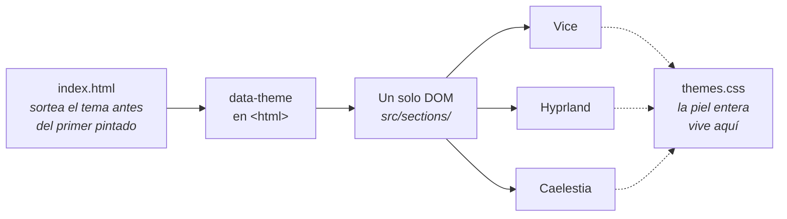
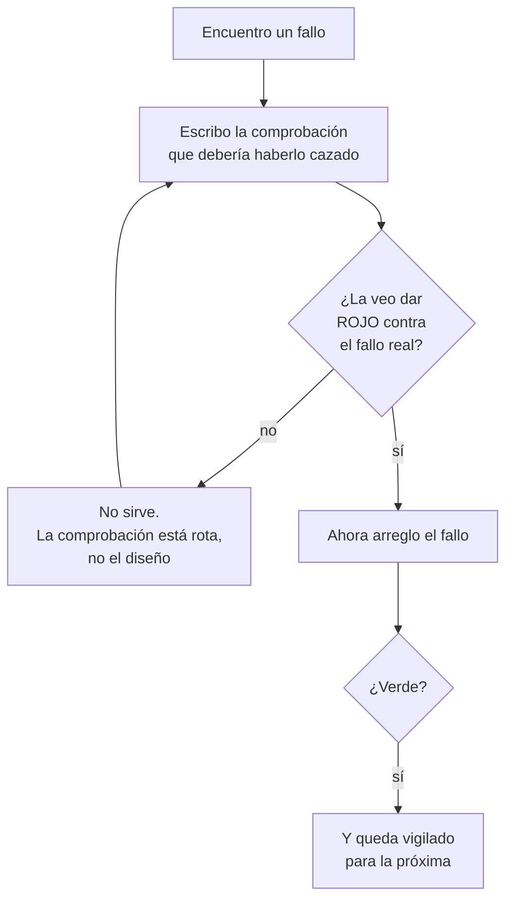
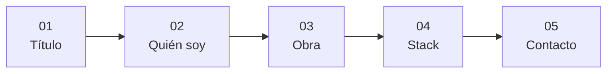

<div align="center">

# Aoshi Blanco Sanz

**Desarrollador full stack · Caracas, Venezuela · Desde 2021**

*Construyo sistemas que aguantan producción, no demos.*

</div>

---

Este repositorio es mi portfolio: una sola página, en español, sin backend.

Podría haber hecho una página con un tema y un modo oscuro. Hice **tres pieles completas
sobre un mismo DOM**, y la que te toca **se sortea en cada visita**. No hay selector, y no
es una funcionalidad pendiente: es la decisión.

## Las tres pieles

<table>
<tr><td width="33%" align="center"><b>Vice City</b></td><td width="33%" align="center"><b>Hyprland</b></td><td width="33%" align="center"><b>Caelestia</b></td></tr>
<tr>
<td></td>
<td></td>
<td></td>
</tr>
<tr>
<td>Cartel de cine ochentero. Coreografía de scroll, letterbox y serigrafía de tinta a dos colores.</td>
<td>Interfaz de gestor de ventanas. Radio cero, sin sombras: la jerarquía la hace la luz.</td>
<td>Un escritorio cuyo <b>color lo gobierna la hora a la que entras</b>. Esta captura es de las 23:33.</td>
</tr>
</table>

El marcado no sabe de qué tema es —lo decide el CSS— así que cada cambio en una sección hay
que juzgarlo en las tres, no en la que tenía abierta. Es más caro de mantener y me obliga a
separar estructura de piel de verdad, que era el punto.



## Cómo trabajo

Buscaba un sitio donde el diseño fuera el producto y no la envoltura, y donde las decisiones
se pudieran defender con algo más que *"me gusta más así"*. De ahí salieron tres costumbres
que ya no me quito.

### Mido antes de decidir

El cursor de Hyprland dibujaba un recuadro naranja alrededor de todo lo pulsable y había que
quitarlo. Lo primero no fue rediseñarlo: fue comprobar cuánta señal quedaba sin él.

| diana | cambio de luminancia sin el recuadro |
|---|---|
| enlace del correo | **+0,003** — imperceptible |
| fila de proyecto | +0,033 |

Ese número decidió el rediseño. El recuadro no era un adorno que sobraba, era **la señal
entera**: no se podía borrar, había que sustituirlo.

### Escribo el porqué, no el qué

Los comentarios de este repo no explican lo que hace la línea de al lado; guardan la medida
que la motivó. Sé por qué un tamaño es 67,4 y no 89,85, y contra qué fondo se midió cada
contraste.

### Desconfío de mis propias comprobaciones

Un test que nunca ha fallado no demuestra nada. Aquí he encontrado **quince comprobaciones
rotas** que daban verde con el defecto delante. La peor vigiló durante semanas un cursor que
rodeaba de naranja cada enlace del sitio: medía la luz y nunca miró el borde.



Suena a ceremonia y es al revés: la mitad de las veces el fallo estaba en el instrumento y
no en la página, y sin este paso habría "arreglado" código que no tenía nada roto.

## Las cinco escenas



Todo el texto —los proyectos, las tecnologías, los datos de contacto— vive en un solo sitio,
`src/data/content.ts`, y las secciones no llevan ni una frase incrustada.

## Cómo verlo

**Sin deploy todavía**: el sitio no está en ninguna URL, así que por ahora la única forma de
verlo es clonarlo.

```bash
nvm use          # Node 22, está en .nvmrc
npm install
npm run dev      # http://localhost:5173
```

El tema se sortea, así que para ver uno concreto hay que fijarlo:

```
http://localhost:5173/?theme=hyprland      # o vice, o caelestia
```

## Lo técnico, en corto

**Vite 8** · **TypeScript** en modo `strict` · **Tailwind 4** · **GSAP 3** con ScrollTrigger ·
**Lenis**.

Sin framework, sin backend y **sin Three.js**: los fondos son shaders de fragmento WebGL
escritos a mano en `src/backgrounds/`, no una escena 3D.

| comando | qué hace |
|---|---|
| `npm run build` | `tsc && vite build` — si TypeScript se queja, el build falla |
| `npm run lint` | ESLint |
| `npm run preview` | sirve el build de producción |
| `python3 scripts/verify.py` | comprobación en navegador real |

Que compile no demuestra nada en un proyecto de shaders y animación. Antes de dar algo por
terminado corre `verify.py`, y para lo que tenga que mirarse de cerca hay arneses propios en
`scripts/measure-*.py`, uno por dispositivo. Cada uno nació de un fallo real y lo cuenta en
su propia cabecera.

Las reglas que no son negociables —y ninguna es preferencia estética: todas salieron de una
regresión— están en `CLAUDE.md`. El registro de cada decisión de diseño, con sus medidas y lo
que se descartó por el camino, está en `docs/superpowers/specs/`.

## Contacto

**a.blanco1501@gmail.com** · [GitHub](https://github.com/Aoshi346) ·
[LinkedIn](https://www.linkedin.com/in/aoshi-blanco-sanz-14119b2b7)

## Licencia

Sin licencia pública. Todos los derechos reservados: el contenido, los textos y las imágenes
son personales.
