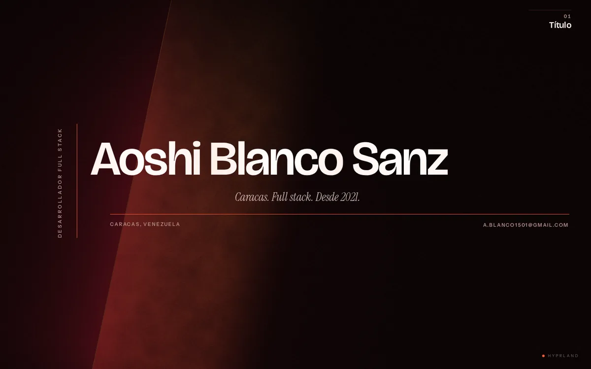
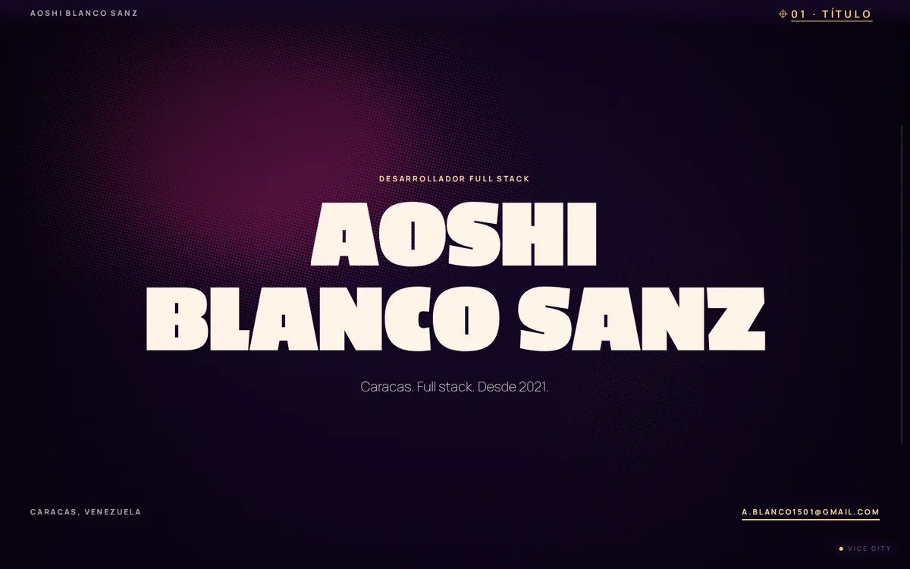
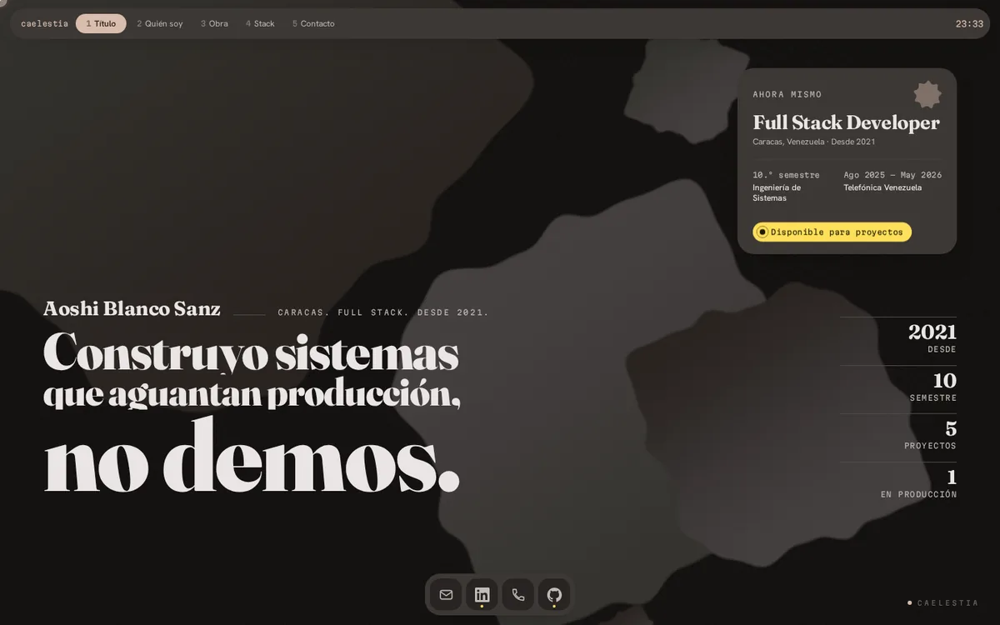
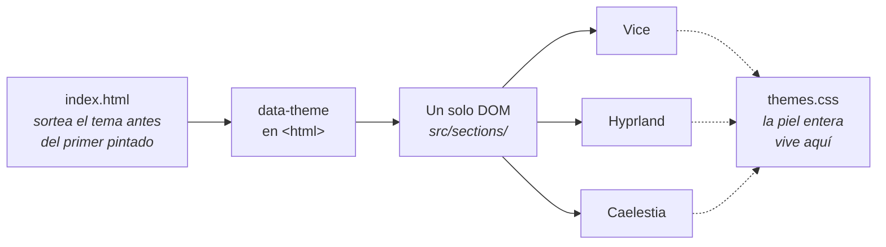
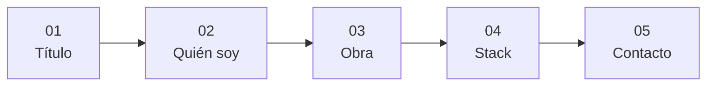

<div align="center">

# Portfolio — Aoshi Blanco Sanz

**Una sola página. Tres pieles completas. La que ves se sortea en cada visita.**

Desarrollador full stack · Caracas, Venezuela

</div>

<div align="center">
  
</div>

---

## Sobre el proyecto

Este es mi portfolio. Lo hice porque quería un sitio donde el diseño fuera el producto y no
la envoltura, y de paso un banco de pruebas honesto: WebGL, coreografía de scroll y
accesibilidad sobre algo que tengo que defender yo.

Podría haber hecho una página con un tema y un modo oscuro. Hice **tres pieles completas
sobre un mismo DOM**, y la que te toca **se sortea al entrar**. No hay selector: es la
decisión, no una funcionalidad pendiente.

## Las tres pieles

<table>
<tr>
<td width="33%" align="center"><b>Vice</b></td>
<td width="33%" align="center"><b>Hyprland</b></td>
<td width="33%" align="center"><b>Caelestia</b></td>
</tr>
<tr>
<td></td>
<td></td>
<td></td>
</tr>
<tr>
<td>Cartel de cine ochentero: coreografía de scroll, letterbox y un fondo de serigrafía a dos tintas.</td>
<td>Interfaz de gestor de ventanas. Radio cero y sin sombras: la jerarquía la hace la luz.</td>
<td>Un escritorio cuyo <b>color lo gobierna la hora a la que entras</b>. La captura es de las 23:33.</td>
</tr>
</table>

## Qué tiene

- **Tres temas sobre un mismo marcado.** El HTML no sabe de qué tema es: lo decide el CSS a
  través de `data-theme`. Cambiar una sección obliga a juzgarla en las tres.
- **Fondos generativos en WebGL.** Shaders de fragmento escritos a mano, uno por tema, no una
  escena 3D.
- **Un cursor propio por tema**, que se apaga sobre texto corrido y deja el del sistema.
- **Coreografía de scroll** con GSAP y ScrollTrigger, y desplazamiento suave con Lenis.
- **Accesible de verdad**: contraste medido contra el fondo real —que se mueve—, foco de
  teclado visible en todo lo pulsable, y cada animación con su alternativa para
  `prefers-reduced-motion`.
- **Todo el contenido en un solo sitio**, `src/data/content.ts`. Las secciones no llevan ni
  una frase incrustada.



## Las cinco escenas



## Construido con

**Vite 8** · **TypeScript** en modo `strict` · **Tailwind 4** · **GSAP 3** con ScrollTrigger ·
**Lenis** · **WebGL** crudo

Sin framework, sin backend y **sin Three.js**.

## Cómo verlo

> **Sin deploy todavía.** El sitio no está publicado en ninguna URL, así que por ahora la
> única forma de verlo es clonarlo.

```bash
git clone https://github.com/Aoshi346/portfolio-aoshi.git
cd portfolio-aoshi
nvm use          # Node 22, está en .nvmrc
npm install
npm run dev      # http://localhost:5173
```

El tema se sortea al entrar, así que para ver uno concreto hay que fijarlo:

```
http://localhost:5173/?theme=vice
http://localhost:5173/?theme=hyprland
http://localhost:5173/?theme=caelestia
```

| comando | qué hace |
|---|---|
| `npm run dev` | servidor de desarrollo |
| `npm run build` | `tsc && vite build` |
| `npm run preview` | sirve el build de producción |
| `npm run lint` | ESLint |

## Contacto

**a.blanco1501@gmail.com**

[GitHub](https://github.com/Aoshi346) · [LinkedIn](https://www.linkedin.com/in/aoshi-blanco-sanz-14119b2b7)

## Licencia

Sin licencia pública. Todos los derechos reservados: el contenido, los textos y las imágenes
son personales.
